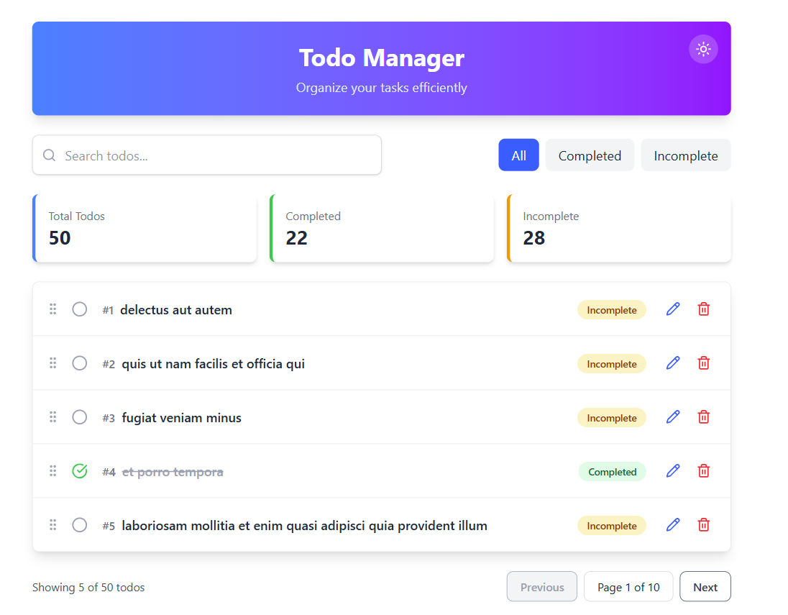

# React Todo Manager App

  


A scalable and performant Todo Manager application built with **React**, featuring:

- CRUD operations
- Drag & Drop reordering
- Filtering & search
- Unit & integration testing
- Clean architecture & modular structure

---

##  Live Demo

[View Live App (Vercel/Netlify)](https://your-deployment-link.com)

---

## 🧠 Tech Stack

- **React**
- **TypeScript**
- **Axios**
- **TailwindCSS**
- **React Beautiful DnD**
- **Vite**

---

## 📦 Features

### ✅ Core Functionality
- Fetch todos from [`https://jsonplaceholder.typicode.com/todos`](https://jsonplaceholder.typicode.com/todos)
- View todos in a responsive list
- Filter: All / Completed / Incomplete
- Search by title
- Edit todos in a modal (title + completion status)
- Delete with confirmation
- Drag and Drop support for reordering
- Toast notifications (success & error)

### 🧪 Tests
- Unit tests for custom hook (`useTodos`)
- Integration tests for the Todo list and edit modal

---

## 🗂 Folder Structure

```bash
todo-manager/
├─ public/
│  └─ vite.svg
├─ src/
│  ├─ assets/
│  │  └─ react.svg
│  ├─ components/
│  ├─ features/
│  │  ├─ todos/
│  │  │  ├─ components/
│  │  │  │  ├─ EditTodoModal.test.tsx
│  │  │  │  ├─ EditTodoModal.tsx
│  │  │  │  ├─ TodoList.test.tsx
│  │  │  │  └─ TodoList.tsx
│  │  │  └─ hooks/
│  │  │     ├─ ThemeContext.tsx
│  │  │     ├─ useTodos.test.ts
│  │  │     └─ useTodos.ts
│  │  └─ types/
│  ├─ services/
│  ├─ App.tsx
│  ├─ index.css
│  ├─ main.tsx
│  ├─ setupTests.ts
│  └─ vite-env.d.ts
├─ .gitignore
├─ eslint.config.js
├─ index.html
├─ package-lock.json
├─ package.json
├─ README.md
├─ tsconfig.app.json
├─ tsconfig.json
├─ tsconfig.node.json
└─ vite.config.ts

```

## 🛠️ Development Setup

1. **Clone the repository**
   ```bash
   git clone https://github.com/CE-droid/todo.git
   cd todo

1. **Install dependencies** :
   ```bash
    npm install
2. **Run the development server**:
   ```bash
      npm run dev
3. **Access the app**:
   ```bash
     http://localhost:3000